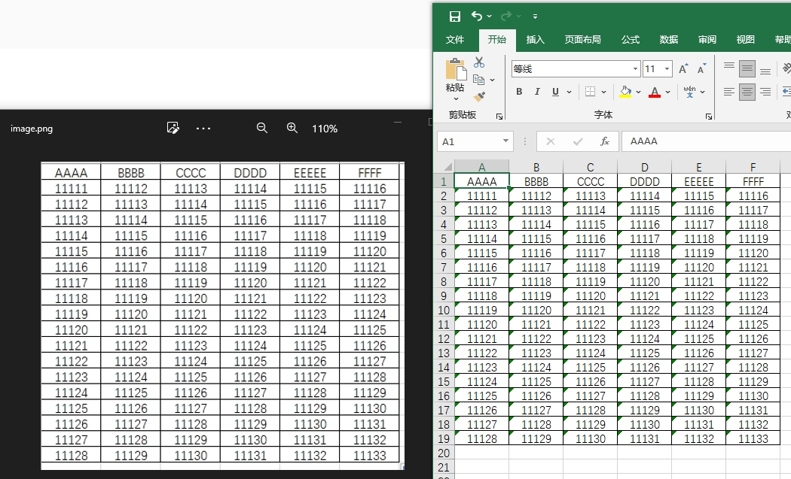

# ocrExcel
离线ocr识别为excel文件,基于[PaddleOCR-json](https://github.com/hiroi-sora/PaddleOCR-json).
仅支持windows

# 使用方式

## 直接使用
- 从release中下载点击start.bat启动
## 2.手动打包
- 打包 maven clean package
- 打包后放入ocrExcelUtil文件夹中
- 点击start.bat启动

# 识别效果

